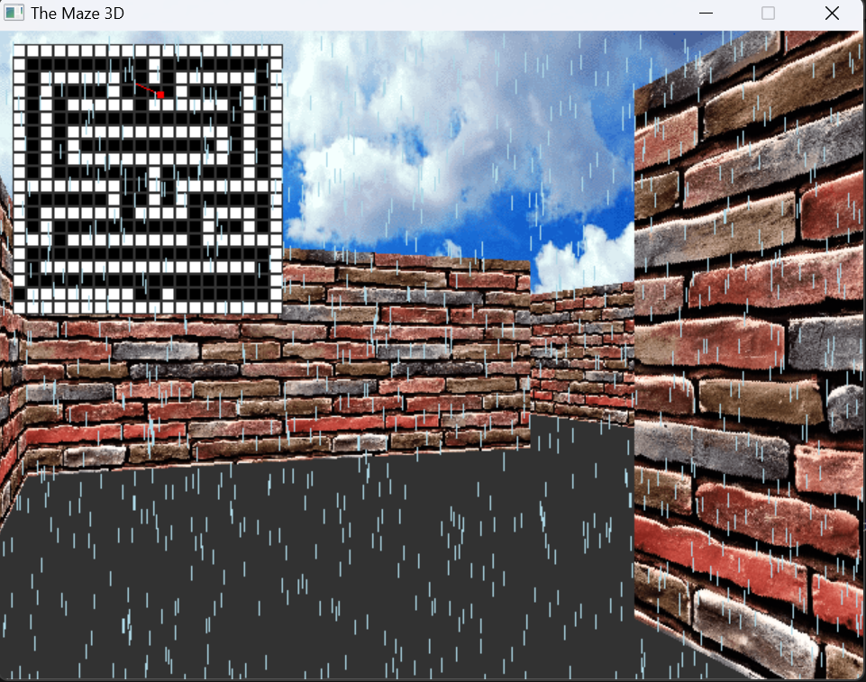

# The Maze 3D Game

The Maze 3D is a simple 3D maze game created using SDL2 in C. In this game, players can navigate through a maze, rendered using basic raycasting techniques, and observe a 2D minimap for guidance. Additionally, a rain effect has been added to enhance the game's environment, simulating a rainy atmosphere as the player explores the maze.

## Features
- **3D Maze Rendering**: The game uses raycasting to render a 3D view of the maze.
- **2D Minimap**: A minimap is displayed on the screen, showing the player's position and orientation within the maze.
- **Rain Effect**: Simulated raindrops fall across the screen, except for the area covered by the 2D minimap.
- **Textured Walls, Floor, and Ceiling**: The maze environment is brought to life with textures on the walls, floor, and ceiling.

## Game Preview


## Requirements
To compile and run the game, you'll need the following libraries:
- **SDL2**: For rendering graphics and handling input.
- **SDL2_image**: For loading PNG textures for walls, floor, and ceiling.

Make sure to install these libraries using your package manager. For example, on Ubuntu:
```bash
sudo apt-get install libsdl2-dev libsdl2-image-dev
```
## Installation
```bash
$ git clone https://github.com/Muawia24/The_Maze_3d.git
```

## Compailation and Running The Game
To compile the game, use the following command in your terminal:
```bash
$ make
```
This creates an executable maze, run the Game by running this on terminal:
```bash
$./maze
```

### Controls

- **UP & W**: Move forward
- **Down & S**: Move backward
- **LEFT & A**: Rotate left
- **RIGHT & D**: Rotate right
- **Esc**: Quit the game

## Features

#3D Maze Gameplay:

- Navigate through a maze where you can see textured walls, ceiling, and floor.
- Player movement is handled with smooth wall sliding when a collision occurs.

#2D Minimap:

- The minimap provides a bird's-eye view of the maze.
- The player's current position and orientation are displayed on the minimap, allowing for easier navigation.

# Rain Effect:

- A simple particle system simulates raindrops falling from the sky.
- Raindrops are rendered as lines and avoid the 2D minimap area, ensuring that the minimap remains clear.

## Customizing the Map

You can modify [Map file](maps/map.txt) to create different maze layouts. Each line should have 20 characters, representing the width of the maze.

## Authors

- **Ahmed Muawia**: [Github](https://github.com/Muawia24), [Twitter](https://x.com/0x01_Muawia).
- **Omer Elbasheer**: [Github](https://github.com/Mr-Robinhood), [Twitter](https://x.com/omerjr7)
